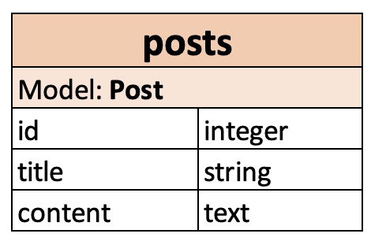

# Blog Post: AJAX CRUD

This project presents a simple blog post developing the CRUD (Create, Read, Update and Delete) from zero with AJAX (Asynchronous JavaScript and XML) without the use of scaffold.

## 1. Adding Bootstrap

First, the next gems are integrated and bundled:

```ruby
# gemfile.rb

gem "bootstrap", "~> 5.1"
gem "jquery-rails", "~> 4.4"
```

Then, in the javascript manifest Bootstrap is require as:

```javascript
// application.js

//= require jquery
//= require popper
//= require bootstrap
```

And finally, it is called from the SCSS file in the main view:

```css
/* home.scss */

@import 'bootstrap';
```

## 2. Defining the model

<p align="center"></p>

The previews image summarize the model and it is generated as it follows from the console:

```console
rails g model Post title content:text
```

Home will be the controller that will display the index and it's generated as:

```console
rails g controller Home index
```

The controller Post is also generated and will be the one where the CRUD is going to take place.

```console
rails g controller Post
```

## 3. Implementing the CRUD

### 3.1 Index

```ruby
# home_controller.rb

class HomeController < ApplicationController
  def index
    @posts = Post.order(:created_at).reverse_order
    @post = Post.new
  end
end
```

```html
<!-- home/index.html.erb -->

<div id="form"></div>
<div id="showTweet"></div>

<table class="table">
    <thead class="table-light">
      <tr>
          <th scope="col">Id</th>
          <th scope="col">Title</th>
          <th scope="col">Content</th>
          <th scope="col" colspan="3"></th>
      </tr>
    </thead>
    <tbody id="posts">
        <% @posts.each do |post| %>
            <tr id="post-<%= post.id %>">
                <td><%= post.id %></td>
                <td><%= post.title %></td>
                <td><%= post.content %></td>
                <td><%= link_to 'See', post, remote: true, class: 'btn btn-success' %></td>
                <td><%= link_to 'Edit', edit_post_path(post), remote: true, class: 'btn btn-warning' %></td>
                <td><%= link_to 'Delete', post, method: :delete, remote: true, data: { confirm: "Are you sure to delete: #{post.title}?" }, class: 'btn btn-danger' %></td>
            </tr>
        <% end %>
    </tbody>
</table>

<div id="button">
    <%= link_to 'New post', new_post_path, class: 'btn btn-primary', remote: true %>
</div>
```

### 3.2 Show

```ruby
# posts_controller.rb

class PostsController < ApplicationController
  before_action :set_post, only: [:show] 

  def show
  end

  private

  def set_post
    @post = Post.find(params[:id])
  end

  def post_params
    params.require(:post).permit(:content, :title)
  end
```

### 3.3 Create

```ruby
# posts_controller.rb

class PostsController < ApplicationController
  before_action :set_post, only: [:show] 

  def create
    @post = Post.new(post_params)
    respond_to do |format|
      if @post.save!
        format.js { render nothing: true, notice: 'Post saved!' }
      end
    end
end
```

### 3.4 Edit

```ruby
# posts_controller.rb

class PostsController < ApplicationController
  before_action :set_post, only: [:edit, :show] 

  def edit
  end
end
```

### 3.5 Update 

```ruby
before_action :set_post, only: [:edit, :show, :update] 

def update
    respond_to do |format|
      if @post.update!(post_params)
        format.js { render layout: false, notice: 'Updated post' }
      end
    end
end
```

### 3.6 Delete

```ruby
before_action :set_post, only: [:edit, :show, :update, :destroy] 

def destroy
    respond_to do |format|
      if @post.destroy!
        format.js { render layout: false, notice: 'Post deleted!' }
      end
    end
end
```

## 4. Adding the Search bar